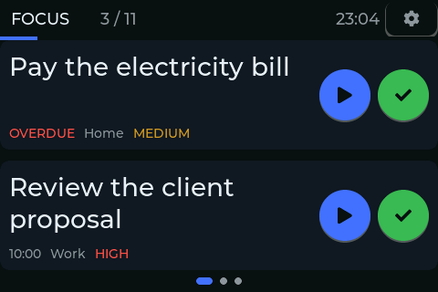
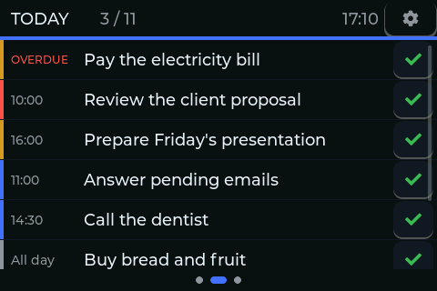
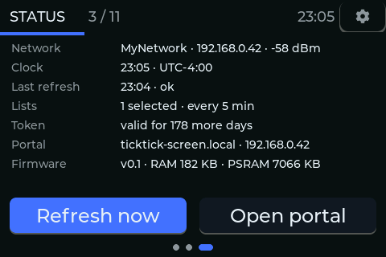
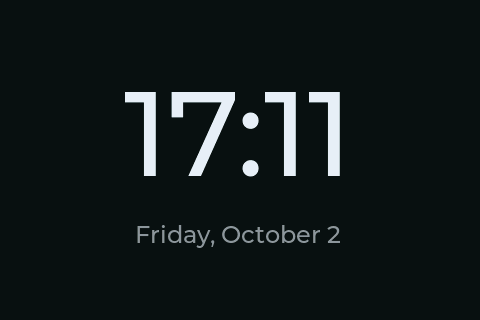
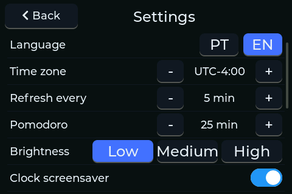
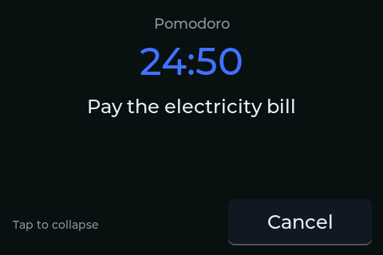

# TickTick Screen

A desk display for your TickTick day, on a 3.5" ESP32-S3 touch screen.

*[Leia em português](README.pt-BR.md)*

## Screenshots



| | |
|---|---|
|  |  |
|  |  |
|  | |

*(Screenshots above are from demo mode — see [Console](#console) — so no real task ever leaves the device.)*

## What it does

- **Focus**: the two next tasks on deck, each with a pomodoro (play) button and a complete
  button (one tap); long-press a card to pin it on top regardless of due time.
- **Today**: the whole day's tasks in one scrollable list; tap a task for an action sheet
  with **Complete · Pomodoro · Pin**.
- **Status**: network and signal, clock and time zone, last refresh, selected lists, pairing
  token state, portal address, firmware version and free memory, plus **Refresh now** and
  **Open portal** buttons.
- **Clock**: tap the time in the header to open a full-screen clock with the date.
- **Pomodoro per task**: start a cycle from Focus or Today's action sheet; the day counter in
  the header is replaced by the countdown while it runs; tapping it expands to a full-screen
  overlay. At the end: **Renew · Cancel · Complete**.
- **Settings** (gear icon): language, time zone, refresh interval, pomodoro length, lists for
  the day, WiFi network, PIN, certificate verification, and factory reset.
- **Offline behavior**: if a refresh fails, the screen keeps the last data it had and shows a
  small "stale" badge in the header instead of freezing or going blank.

## Hardware

- Board: **Guition JC4832W535** (ESP32-S3).
- 16 MB flash, **8 MB PSRAM (OPI, required)**.
- Display: **AXS15231B**, QSPI, 480×320 landscape.
- Touch: AXS15231B capacitive touch controller, over I2C.
- A USB-C cable for flashing and serial console.

## Build

Toolchain, pinned:

- `arduino-cli` with the **esp32 core 3.3.11**.
- Libraries: **LVGL 9.2.2**, **GFX Library for Arduino 1.6.5**, **ArduinoJson 7.2.0**.

Commands:

```bash
./firmware/ticktick_screen/build.sh              # compile
./firmware/ticktick_screen/build.sh upload [PORT] # compile + flash (port auto-detected if omitted)
./firmware/ticktick_screen/build.sh monitor       # serial monitor at 115200 baud
```

Fonts (accented Latin-1 UI font plus the clock digit font) are generated with
`tools/gen_fonts.sh`, which pins `lv_font_conv 1.5.3` and requires `--no-compress` (LVGL 9.2 is
built without the decompressor, so a compressed font would render every glyph as a blank box).

Optional header logo: the TickTick icon is a third-party trademark, so it is not in the repository.
To show it centered in the header, save the icon as a white-background PNG in `assets-local/`
(git-ignored) and run `python tools/logo2c.py assets-local/<icon>.png --size 28 --out firmware/ticktick_screen/src/assets`.
Without the generated files the firmware builds normally, with no logo.

## Tests

Two independent host-side suites, no board required:

```bash
bash tests/run.sh                                   # core/ in C++ (g++/clang++, or MSVC on Windows)
python -m unittest discover -s tests/helper -v       # helper/pair.py and tools/shot2png.py
```

## Pairing

1. Register an app at the [TickTick developer center](https://developer.ticktick.com) with
   the OAuth redirect URL `http://127.0.0.1:8080/callback`.
2. Copy `helper/.env.example` to `helper/.env` and fill in the Client ID and Client Secret.
3. Run `python helper/pair.py`. It opens a browser, completes the OAuth dance locally, and
   prints a one-time **pairing blob**.
4. Send the blob to the device, either:
   - **(a) Portal** (default): open `http://ticktick-screen.local` (or the IP address shown
     on the device's Status screen) in a browser and paste the blob; or
   - **(b) Console**, for networks with client isolation (guest networks, some mesh routers)
     where a PC on the network cannot reach the device: save the blob to a file outside the
     repository and run
     ```bash
     tools/console.sh -c 180 "pair $(cat ~/tt-blob.txt)"
     ```
     keeping the serial port open while you choose a PIN on the screen (opening and closing
     the serial port restarts the board).

The blob contains your account's tokens: never commit it or share it.

## PIN

Setting a PIN (in Settings) encrypts the stored credentials with AES-256-GCM, and the device
asks for the PIN at every boot. Wrong attempts lock the device for increasing amounts of time,
and erase the stored credentials once the attempt limit is reached.

## Console

The device exposes a command console over the USB serial port (`tools/console.sh`). Run
`help` for the full list; some of the more useful ones:

| Command | What it does |
|---|---|
| `pin <digits>` | unlocks the PIN screen from the serial port |
| `go <screen>` | navigates without touching the screen |
| `refresh` | fetches today's tasks now |
| `mem` | free memory (LVGL, internal RAM, PSRAM) |
| `demo on\|off` | loads/clears the demo tasks used for screenshots |
| `shot <name>` | sends the current frame over serial as a PNG-ready block |
| `lang pt\|en` | switches the UI language |
| `poll <min>` | sets the refresh interval |
| `tls cadeia\|inseguro` | sets certificate validation on/off |

Screenshots for this README are produced by `tools/capture_readme.sh`, which drives the
console through demo mode in both languages and converts the output with `tools/shot2png.py`.

## Project layout

```
firmware/ticktick_screen/src/
  core/      pure C++, no Arduino/LVGL/WiFi — task filtering & sorting, clock formatting,
             settings value steps, payload parsing — tested on the PC (tests/run.sh)
  platform/  hardware-facing code — display driver, clock, serial console, NVS settings,
             screenshot capture
  net/       HTTP/TLS client, TickTick API calls, OAuth token storage, JSON payload policy
  app/       application logic — sync with the TickTick API, pairing, pomodoro, console
             command wiring
  ui/        LVGL screens, shell (header/nav), theme, i18n
helper/      pair.py, a one-shot desktop OAuth pairing tool
tools/       build/flash script, serial console, font generator, screenshot tools
tests/       host-side C++ tests (core/) and Python tests (helper/, tools/)
docs/        specs, hardware notes, and the screenshots in docs/images/
```

## Credits

This project is based on
[claude-usage-stick-SVGL](https://github.com/benevid/claude-usage-stick-SVGL) by
[@benevid](https://github.com/benevid), itself a fork of the original
[claude-usage-stick](https://github.com/oauramos/claude-usage-stick) by
[@oauramos](https://github.com/oauramos). Their firmware runs on the same board and was
the reference for bringing it up.

Adapted from it:
- the bring-up sketch (`firmware/bringup/`: board config, touch driver, `lv_conf.h`)
- the Wi-Fi manager (`src/platform/wifi_manager.h`)
- the PIN-based key derivation (`src/net/crypto.h`)
- the display brightness levels (`src/platform/display.cpp`)

Thanks to everyone who contributed to those projects.

## License

[MIT](LICENSE). This project is not affiliated with or endorsed by TickTick.
