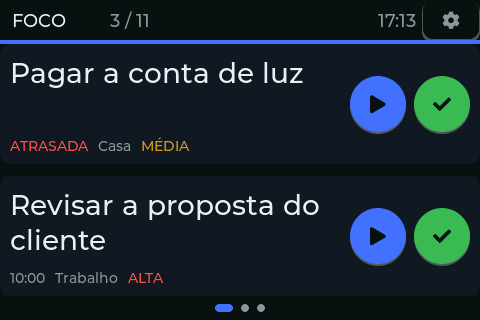
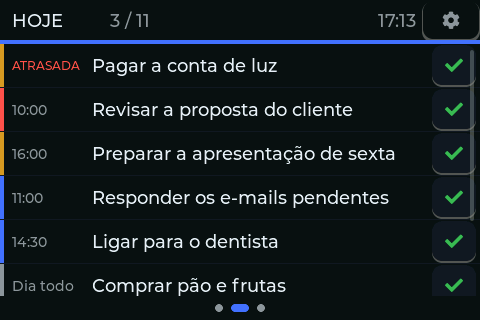
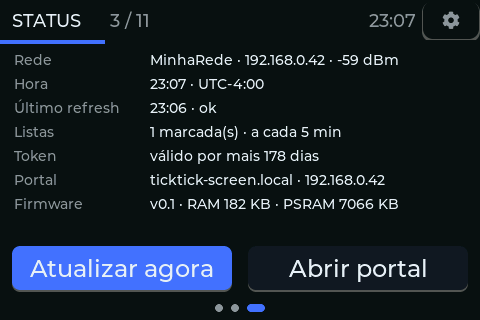
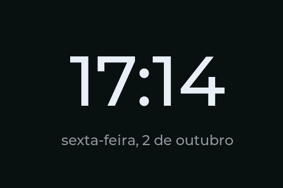
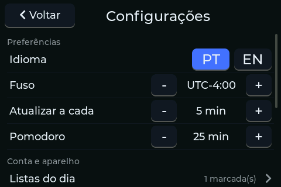
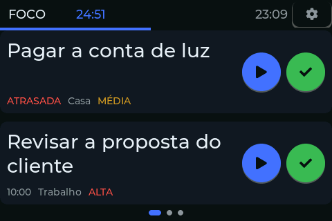

# TickTick Screen

Um mostrador de mesa para o seu dia no TickTick, numa tela de toque de 3,5" com ESP32-S3.

*[Read in English](README.md)*

## Capturas de tela



| | |
|---|---|
|  |  |
|  |  |
|  | |

*(As capturas acima vêm do modo demonstração — veja [Console](#console) — nenhuma tarefa real
sai do aparelho.)*

## O que ele faz

- **Foco**: as duas próximas tarefas, cada uma com um botão de pomodoro (play) e um botão de
  concluir (um toque); toque longo no card fixa a tarefa no topo, independente do horário.
- **Hoje**: o dia inteiro numa lista rolável; tocar numa tarefa abre uma folha de ação com
  **Concluir · Pomodoro · Fixar**.
- **Status**: rede e sinal, hora e fuso, último refresh, listas selecionadas, estado do
  pareamento, endereço do portal, versão do firmware e memória livre, além dos botões
  **Atualizar agora** e **Abrir portal**.
- **Relógio**: tocar na hora do cabeçalho abre um relógio em tela cheia, com a data. Ele também
  é a tela de descanso: depois de 30 minutos sem toque nas telas principais ele abre sozinho
  (nunca com um pomodoro rodando ou com o aviso de fim aberto) e se desloca alguns pixels a
  cada minuto para não marcar a tela. Qualquer toque volta.
- **Pomodoro por tarefa**: iniciar um ciclo pelo Foco ou pela folha de ação do Hoje abre a
  contagem em tela cheia; tocar fora dos botões recolhe. Enquanto o ciclo roda, o contador do
  dia no cabeçalho vira a contagem regressiva; tocar nela abre a tela cheia de novo.
  No fim: **Renovar · Cancelar · Concluir**.
- **Configurações** (ícone de engrenagem): idioma, fuso, intervalo de atualização, duração do
  pomodoro, brilho, relógio em descanso (liga/desliga), listas do dia, rede WiFi, PIN,
  verificação de certificado e reset de fábrica.
- **Comportamento offline**: se um refresh falha, a tela mantém os últimos dados que tinha e
  mostra um selo "desatualizado" no cabeçalho, em vez de travar ou ficar em branco.

## Hardware

- Placa: **Guition JC4832W535** (ESP32-S3).
- 16 MB de flash, **8 MB de PSRAM (OPI, obrigatória)**.
- Display: **AXS15231B**, QSPI, 480×320 paisagem.
- Toque: controlador capacitivo AXS15231B, por I2C.
- Um cabo USB-C para gravação e console serial.

## Build

Ferramentas, com versões travadas:

- `arduino-cli` com o **core esp32 3.3.11**.
- Bibliotecas: **LVGL 9.2.2**, **GFX Library for Arduino 1.6.5**, **ArduinoJson 7.2.0**.

Comandos:

```bash
./firmware/ticktick_screen/build.sh              # compila
./firmware/ticktick_screen/build.sh upload [PORT] # compila + grava (porta detectada se omitida)
./firmware/ticktick_screen/build.sh monitor       # monitor serial a 115200 baud
```

As fontes (a fonte da UI com acentuação Latin-1 e a fonte dos dígitos do relógio) são geradas
por `tools/gen_fonts.sh`, que trava o `lv_font_conv` na versão 1.5.3 e exige `--no-compress`
(o LVGL 9.2 é compilado sem o descompressor, e uma fonte comprimida faria todo glifo desenhar
como um retângulo em branco).

Logo opcional no header: o ícone do TickTick é marca de terceiros, por isso não está no
repositório. Para mostrá-lo centralizado no header, salve o ícone em PNG com fundo branco em
`assets-local/` (ignorada pelo git) e rode `python tools/logo2c.py assets-local/<ícone>.png --size 28 --out firmware/ticktick_screen/src/assets`.
Sem os arquivos gerados, o firmware compila normalmente, sem o logo.

## Testes

Duas suítes independentes, rodadas no PC, sem placa nenhuma envolvida:

```bash
bash tests/run.sh                                   # core/ em C++ (g++/clang++, ou MSVC no Windows)
python -m unittest discover -s tests/helper -v       # helper/pair.py e tools/shot2png.py
```

## Pareamento

1. Cadastre um app no [centro de desenvolvedores do TickTick](https://developer.ticktick.com)
   com a "OAuth redirect URL" `http://127.0.0.1:8080/callback`.
2. Copie `helper/.env.example` para `helper/.env` e preencha o Client ID e o Client Secret.
3. Rode `python helper/pair.py`. Ele abre um navegador, completa a dança do OAuth localmente e
   imprime um **blob de pareamento** de uso único.
4. Mande o blob para o aparelho, de duas formas:
   - **(a) Portal** (padrão): abra `http://ticktick-screen.local` (ou o IP mostrado na tela de
     Status do aparelho) num navegador e cole o blob; ou
   - **(b) Console**, para redes com isolamento de clientes (redes de convidado, alguns
     roteadores em malha) onde um PC da rede não alcança o aparelho: salve o blob num arquivo
     fora do repositório e rode
     ```bash
     tools/console.sh -c 180 "pair $(cat ~/tt-blob.txt)"
     ```
     mantendo a porta serial aberta enquanto você escolhe um PIN na tela (abrir e fechar a
     porta serial reinicia a placa).

O blob contém os tokens da sua conta: nunca o coloque num commit nem o compartilhe.

## PIN

Definir um PIN (em Configurações) cifra as credenciais guardadas com AES-256-GCM, e o
aparelho passa a pedir o PIN em todo boot. Tentativas erradas bloqueiam o aparelho por tempos
crescentes, e apagam as credenciais guardadas quando o limite de tentativas é atingido.

## Console

O aparelho expõe um console de comandos pela porta serial USB (`tools/console.sh`). Rode
`help` para a lista completa; alguns dos mais úteis:

| Comando | O que faz |
|---|---|
| `pin <dígitos>` | desbloqueia a tela de PIN pela porta serial |
| `go <tela>` | navega sem tocar na tela |
| `refresh` | busca as tarefas do dia agora |
| `mem` | memória livre (LVGL, RAM interna, PSRAM) |
| `demo on\|off` | carrega/limpa as tarefas de exemplo usadas nas capturas |
| `descanso on\|off\|<seg>` | liga/desliga o relógio em descanso, ou encurta a espera para testar (0 = 30 min) |
| `shot <nome>` | manda o quadro atual pela serial, pronto para virar PNG |
| `lang pt\|en` | troca o idioma da interface |
| `poll <min>` | define o intervalo de atualização |
| `tls cadeia\|inseguro` | liga/desliga a validação do certificado |

As capturas deste README saem de `tools/capture_readme.sh`, que conduz o console pelo modo
demonstração nos dois idiomas e converte a saída com `tools/shot2png.py`.

## Estrutura do projeto

```
firmware/ticktick_screen/src/
  core/      C++ puro, sem Arduino/LVGL/WiFi — filtragem e ordenação de tarefas, formatação
             de hora, passos de valores de configuração, leitura do payload — testado no PC
             (tests/run.sh)
  platform/  código ligado ao hardware — driver do display, relógio, console serial,
             configurações na NVS, captura de tela
  net/       cliente HTTP/TLS, chamadas à API do TickTick, guarda dos tokens OAuth, política
             do payload JSON
  app/       lógica do aplicativo — sincronização com a API do TickTick, pareamento,
             pomodoro, ligação dos comandos do console
  ui/        telas LVGL, shell (cabeçalho/navegação), tema, i18n
helper/      pair.py, ferramenta de pareamento OAuth de uso único no desktop
tools/       script de build/gravação, console serial, gerador de fontes, ferramentas de captura
tests/       testes de host em C++ (core/) e testes em Python (helper/, tools/)
docs/        especificações, notas de hardware e as capturas em docs/images/
```

## Créditos

Este projeto usou como base o
[claude-usage-stick-SVGL](https://github.com/benevid/claude-usage-stick-SVGL), de
[@benevid](https://github.com/benevid), que por sua vez é um fork do
[claude-usage-stick](https://github.com/oauramos/claude-usage-stick) original, de
[@oauramos](https://github.com/oauramos). O firmware deles roda na mesma placa e serviu
de referência para colocá-la em funcionamento.

Partes adaptadas:
- o sketch de bring-up (`firmware/bringup/`: configuração da placa, driver de toque,
  `lv_conf.h`)
- o gerenciador de Wi-Fi (`src/platform/wifi_manager.h`)
- a derivação de chave a partir do PIN (`src/net/crypto.h`)
- os níveis de brilho do display (`src/platform/display.cpp`)

Obrigado a todos os contribuidores desses projetos.

## Licença

[MIT](LICENSE). Este projeto não é afiliado nem endossado pelo TickTick.
